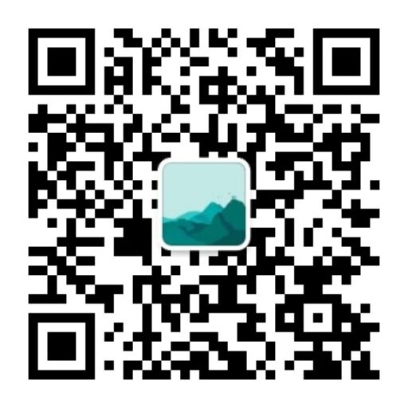

# nof1.ai Alpha Arena AI大模型交易监控系统 (Node.js版本)

监控[AI trading in real markets](https://nof1.ai/) Alpha Arena AI大模型加密货币交易行为的通知系统，当检测到交易变化时会通过 Telegram 机器人发送通知。

[](https://opensource.org/licenses/MIT)
[](https://nodejs.org/)
[](https://www.typescriptlang.org/)

## ⚠️ 免责声明

**本项目仅供学习和研究使用，不构成投资建议。**

- 加密货币交易存在高风险，可能导致资金损失
- 使用本系统进行交易决策的风险由用户自行承担
- 作者不对任何交易损失负责
- 请在使用前充分了解相关风险

## 功能特性

- 🔄 **定时监控**: 每分钟自动获取Alpha Arena持仓数据
- 📊 **变化检测**: 智能分析持仓变化，识别交易行为
- 📱 **实时通知**: 通过 Telegram 机器人发送交易提醒
- 🎯 **精准监控**: 支持指定特定模型进行监控
- 📝 **详细日志**: 完整的操作日志记录
- ⚙️ **灵活配置**: 通过环境变量进行配置管理
- 🐳 **Docker 支持**: 提供 Docker 镜像，便于部署
- 🚀 **GitHub Actions**: 自动化 CI/CD 流程

**通知示例:** 
```
🚨 AI交易监控提醒
⏰ 时间: 2025-10-27 13:21:32
📊 检测到 1 个交易变化:

🤖 qwen3-max [查看持仓](https://nof1.ai/models/qwen3-max)
  🔴 qwen3-max ETH 已平仓 (买多 12.14, 杠杆: 10x, 进入: 4153.2, 当前: 4235.35)


🚨 AI交易监控提醒
⏰ 时间: 2025-10-27 13:23:18
📊 检测到 1 个交易变化:

🤖 qwen3-max [查看持仓](https://nof1.ai/models/qwen3-max)
  🟢 qwen3-max ETH 新开仓: 买多 25.15 (杠杆: 25x, 进入: 4246.35, 当前: 4247.05)
```

## 系统架构

```
AI交易监控系统 (Node.js + TypeScript)
├── src/
│   ├── position_fetcher.ts    # 持仓数据获取模块
│   ├── trade_analyzer.ts      # 交易分析模块
│   ├── telegram_notifier.ts   # Telegram 通知模块
│   ├── trading_monitor.ts     # 定时任务调度模块
│   ├── logger.ts             # 日志配置模块
│   └── main.ts               # 主程序入口
├── .github/
│   └── workflows/            # GitHub Actions 工作流
│       ├── ci.yml           # 持续集成
│       ├── release.yml      # 发布流程
│       └── docker.yml       # Docker 构建
├── package.json             # 项目配置和依赖
├── tsconfig.json            # TypeScript 配置
├── Dockerfile               # Docker 镜像构建文件
└── env.example              # 配置文件示例
```

## 安装和配置

### 方式一：本地安装

#### 1. 安装 Node.js

确保已安装 Node.js 16.0 或更高版本：

```bash
node --version
```

#### 2. 克隆项目

```bash
git clone https://github.com/okay456okay/nof1.ai.monitor.git
cd nof1.ai.monitor
```

#### 3. 安装依赖

```bash
npm install
```

#### 4. 配置环境变量

复制配置文件模板：
```bash
cp env.example .env
```

编辑 `.env` 文件，配置以下参数：

```env
# Telegram Bot Token（必需）
# 通过 @BotFather 创建 bot 后获取
TELEGRAM_BOT_TOKEN=your_bot_token_here

# Telegram Chat ID（必需）
# 可以是私聊、群组或频道的 ID
# 获取方式：发送消息给 @userinfobot 或 @RawDataBot
TELEGRAM_CHAT_ID=your_chat_id_here

# 关注的模型列表，多个用逗号分隔，为空则监控所有模型
# 例如：deepseek-chat-v3.1,claude-sonnet-4-5
MONITORED_MODELS=

# API接口地址
API_URL=https://nof1.ai/api/account-totals

# 日志级别
LOG_LEVEL=INFO

# 是否保存历史数据到data目录（可选）
SAVE_HISTORY_DATA=False
```

#### 5. 获取 Telegram Bot Token 和 Chat ID

**创建 Telegram Bot:**
1. 在 Telegram 中找到 [@BotFather](https://t.me/BotFather)
2. 发送 `/newbot` 命令创建新的 bot
3. 按提示设置 bot 名称和用户名
4. 获取 Bot Token，配置到 `TELEGRAM_BOT_TOKEN`

**获取 Chat ID:**
1. 与你的 bot 对话，或将 bot 添加到群组
2. 向 bot 发送任意消息
3. 访问 `https://api.telegram.org/bot<YOUR_BOT_TOKEN>/getUpdates`
4. 在返回的 JSON 中找到 `chat.id` 字段
5. 或者使用 [@userinfobot](https://t.me/userinfobot) 获取 ID

#### 6. 编译项目

```bash
npm run build
```

### 方式二：使用 Docker

#### 1. 使用 Docker Compose（推荐）

创建 `docker-compose.yml` 文件：

```yaml
version: '3.8'

services:
  nof1-monitor:
    image: ghcr.io/okay456okay/nof1.ai.monitor:latest
    container_name: nof1-ai-monitor
    restart: unless-stopped
    environment:
      - TELEGRAM_BOT_TOKEN=your_bot_token_here
      - TELEGRAM_CHAT_ID=your_chat_id_here
      - MONITORED_MODELS=
      - API_URL=https://nof1.ai/api/account-totals
      - LOG_LEVEL=INFO
      - SAVE_HISTORY_DATA=false
    volumes:
      - ./logs:/app/logs
      - ./data:/app/data
```

启动服务：

```bash
docker-compose up -d
```

#### 2. 直接使用 Docker

```bash
docker run -d \
  --name nof1-ai-monitor \
  --restart unless-stopped \
  -e TELEGRAM_BOT_TOKEN=your_bot_token_here \
  -e TELEGRAM_CHAT_ID=your_chat_id_here \
  -v $(pwd)/logs:/app/logs \
  -v $(pwd)/data:/app/data \
  ghcr.io/okay456okay/nof1.ai.monitor:latest
```

#### 3. 构建自己的 Docker 镜像

```bash
docker build -t nof1-ai-monitor .
docker run -d --name nof1-ai-monitor --env-file .env nof1-ai-monitor
```

## 使用方法

### 本地运行

#### 启动监控系统

```bash
# 开发模式（使用 ts-node）
npm run dev

# 生产模式（需要先编译）
npm run build
npm start
```

#### 测试通知功能

```bash
npm run build
npm run test
```

#### 其他选项

```bash
# 设置日志级别
node dist/main.js --log-level DEBUG

# 指定配置文件
node dist/main.js --config /path/to/.env
```

### Docker 运行

```bash
# 查看日志
docker logs -f nof1-ai-monitor

# 停止服务
docker-compose down

# 重启服务
docker-compose restart

# 测试通知
docker exec nof1-ai-monitor node dist/main.js --test
```

## 监控逻辑

1. **数据获取**: 每分钟从API获取当前持仓数据
2. **数据保存**: 将当前数据保存为 `current.json`，并根据配置决定是否保存到 `data/` 目录
3. **变化检测**: 与上次数据 `last.json` 进行比较
4. **交易分析**: 识别以下交易行为：
   - 新开仓（买入/卖出）
   - 平仓
   - 加仓/减仓
   - 杠杆调整
   - 模型新增/删除
5. **通知发送**: 如有变化，发送 Telegram 通知
6. **数据更新**: 将 `current.json` 重命名为 `last.json`

## 通知格式

系统会发送格式化的 Markdown 消息，包含：

- 🚨 交易提醒标题
- ⏰ 检测时间
- 📊 变化数量统计
- 🤖 按模型分组的交易详情（包含模型持仓链接）
- 📈📉 交易类型图标

## 日志文件

系统会在 `logs/` 目录下生成日志文件：
- `trading_monitor.log`: 主要操作日志（支持日志轮转，最多保留5个文件，每个10MB）

## GitHub Actions 工作流

本项目集成了以下 GitHub Actions 工作流：

### CI（持续集成）
- 在 push 和 pull request 时自动触发
- 在多个 Node.js 版本（16.x, 18.x, 20.x）上测试
- 执行编译检查

### Release（发布）
- 在创建 tag 时自动触发
- 自动构建并上传发布包
- 生成 Release Notes

### Docker Build
- 自动构建 Docker 镜像
- 推送到 GitHub Container Registry
- 支持多架构构建

## 开发

### 目录结构

```
src/
├── position_fetcher.ts    # 持仓数据获取
├── trade_analyzer.ts      # 交易分析
├── telegram_notifier.ts   # Telegram 通知
├── trading_monitor.ts     # 监控调度
├── logger.ts             # 日志配置
└── main.ts               # 程序入口
```

### 编译和监听

```bash
# 编译
npm run build

# 监听模式（自动重新编译）
npm run watch

# 清理编译产物
npm run clean
```

## 注意事项

1. **首次运行**: 第一次运行时会跳过比较，因为不存在历史数据
2. **网络连接**: 确保服务器能够访问 API 和 Telegram 接口
3. **Bot 权限**: 确保 Telegram Bot 有发送消息的权限，如果是群组需要先添加 bot
4. **数据保存**: 系统默认不保存历史数据到`data/`目录，如需保存历史数据请设置 `SAVE_HISTORY_DATA=true`
5. **数据安全**: `current.json` 和 `last.json` 会保存在本地，请注意数据安全
6. **时区设置**: 默认使用北京时间（Asia/Shanghai）

## 故障排除

### 常见问题

1. **通知发送失败**
   - 检查 Telegram Bot Token 是否正确
   - 确认 Chat ID 是否正确
   - 确认机器人没有被屏蔽或移除

2. **API获取失败**
   - 检查网络连接
   - 确认 API 地址是否正确
   - 检查防火墙设置

3. **配置文件错误**
   - 检查 `.env` 文件格式
   - 确认所有必需参数都已配置

4. **Docker 容器无法启动**
   - 检查环境变量是否正确设置
   - 查看容器日志：`docker logs nof1-ai-monitor`

### 调试模式

使用 DEBUG 日志级别获取更详细的调试信息：

```bash
# 本地
node dist/main.js --log-level DEBUG

# Docker
docker run -e LOG_LEVEL=DEBUG ...
```

## 系统要求

- Node.js 16.0+
- 网络连接
- Telegram Bot（通过 @BotFather 创建）

## 依赖包

主要依赖：
- `axios`: HTTP 客户端
- `dotenv`: 环境变量管理
- `node-schedule`: 定时任务调度
- `winston`: 日志管理
- `typescript`: TypeScript 编译器

## 许可证

本项目采用 MIT 许可证 - 查看 [LICENSE](LICENSE) 文件了解详情。

## 贡献

欢迎贡献代码！请查看 [CONTRIBUTING.md](CONTRIBUTING.md) 了解如何参与项目开发。

## 安全

如果您发现了安全漏洞，请查看 [SECURITY.md](SECURITY.md) 了解如何报告。

## 联系方式

如有问题或建议，请通过以下方式联系：

- 创建 [GitHub Issue](https://github.com/okay456okay/nof1.ai.monitor/issues)
- X (Twitter): [@okay456okay](https://x.com/okay456okay)
- 微信公众号：远见拾贝
- 网站: [远见拾贝 - 用远见洞察，赚确定性的钱](https://www.insightpearl.com/)



---

**再次提醒：本项目仅供学习和研究使用，不构成投资建议。加密货币交易存在高风险，请谨慎使用。**
